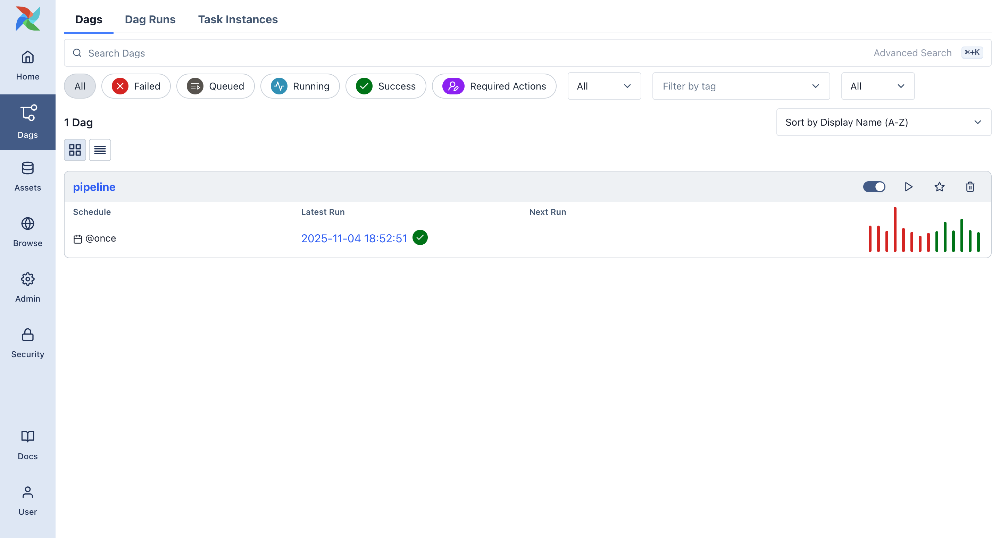
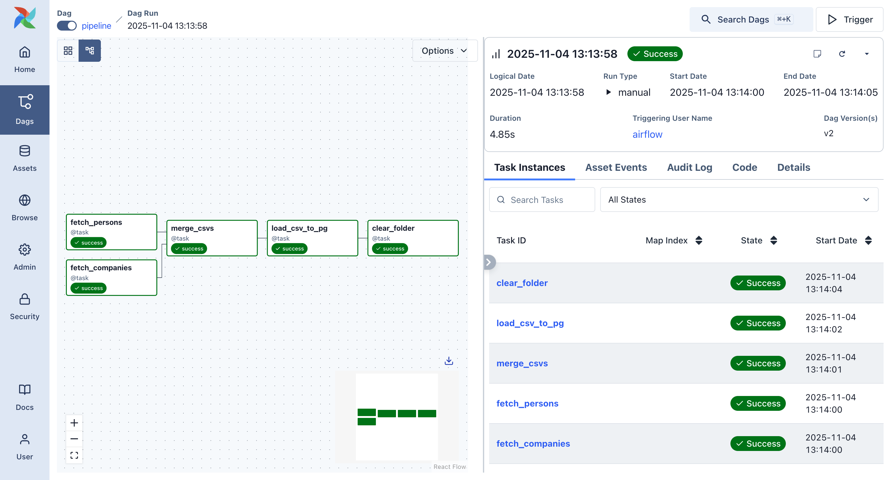
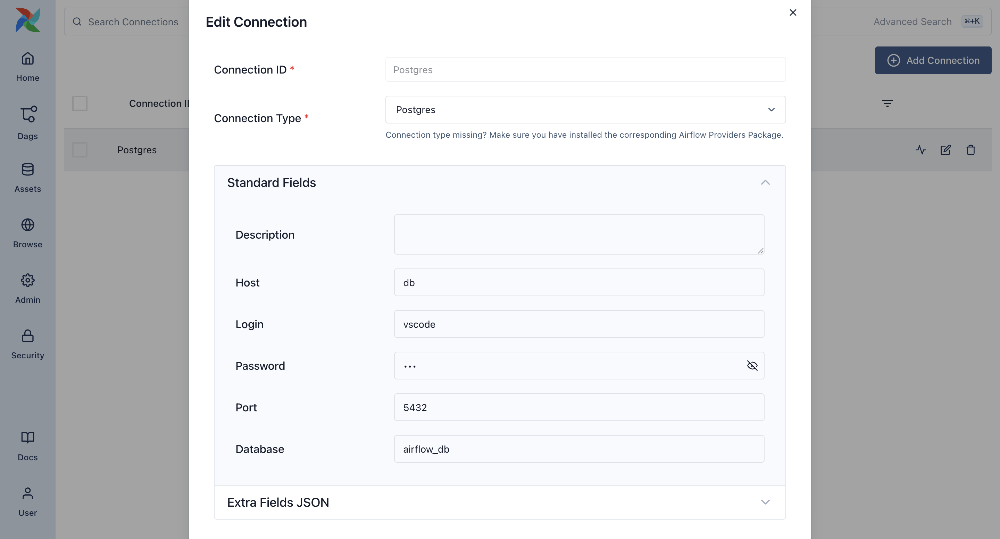
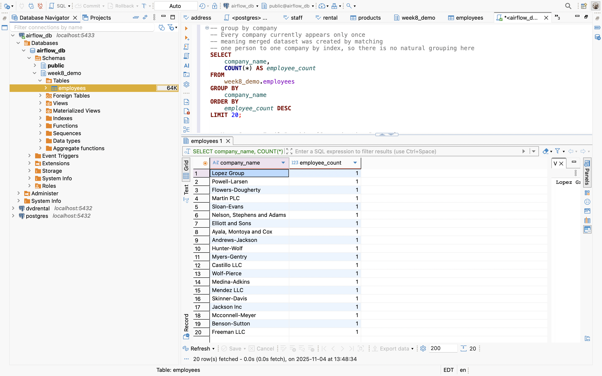
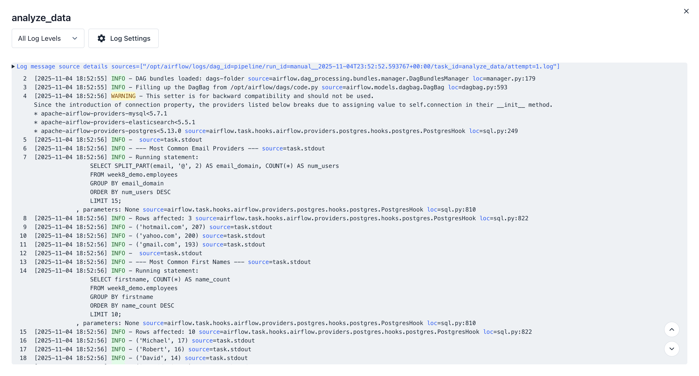
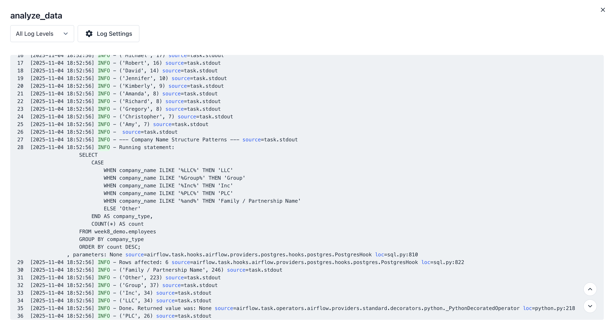
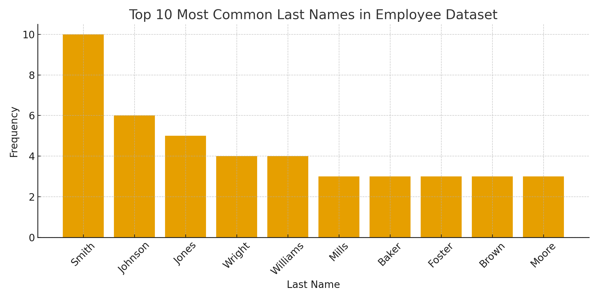
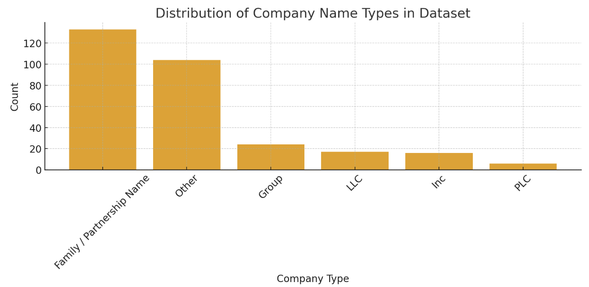

# Airflow ETL Pipeline + PostgreSQL Analysis

## Overview
This project demonstrates a complete **ETL (Extract, Transform, Load)** workflow using **Apache Airflow**, where synthetic person and company datasets are generated, merged, and stored in a **PostgreSQL** database. After loading the data, several **SQL-based analyses** were performed to explore patterns in employee names, email usage, and company naming conventions. Visualizations were created to highlight key findings.

## How to Run
### 1. Start Airflow environment:
```bash
cd .devcontainer
docker compose up -d
```
### 2. Open Airflow UI:
http://localhost:8080

`Login: airflow`

### 3. Trigger the DAG named pipeline

### successfully airflow:





### connect to DBeaver:



### 4. View final dataset in PostgreSQL via DBeaver.



## Pipeline Architecture

### **1. Data Ingestion**
Two datasets were created using the `Faker` library:
- `persons.csv` – first name, last name, phone, email, and address details
- `companies.csv` – company name, contact email, industry-related phrasing

### **2. Data Transformation**
The two datasets were merged **row-by-row** to create a simplified synthetic employee-company relationship.  

This resulted in the final table:

`firstname | lastname | email | company_name | company_email`

### **3. Load to Database**
The final merged dataset was loaded into PostgreSQL under:

`Schema: week8_demo`

`Table: employees`

### **4. SQL Analysis**
The `analyze_data` task in airflow will show the running result  by the SQL code.




### **5. Cleanup**
Intermediate CSV files in `/opt/airflow/data/` were deleted after loading to maintain a clean working environment.


## DAG Summary
| Task | Description |
|------|-------------|
| `fetch_persons` | Generates synthetic person records and saves to CSV |
| `fetch_companies` | Generates synthetic company records and saves to CSV |
| `merge_csvs` | Merges both CSVs into one dataset |
| `load_csv_to_pg` | Loads merged data into PostgreSQL |
| `clear_folder` | Removes intermediate CSVs |


## SQL Analysis

### **1. Company-Level Grouping**
Company names are unique due to one-to-one merge structure, so aggregation is not meaningful:

```sql
SELECT 
    company_name,
    COUNT(*) AS employee_count
FROM week8_demo.employees
GROUP BY company_name
ORDER BY employee_count DESC
LIMIT 20;
```
### **2. Most Common Email Domains**
Shows communication patterns across the dataset:
```sql
SELECT 
    SPLIT_PART(email, '@', 2) AS email_domain,
    COUNT(*) AS num_users
FROM week8_demo.employees
GROUP BY email_domain
ORDER BY num_users DESC
LIMIT 15;
```
Visualization: 


### **2. Most Common Last and First Names**
```sql
SELECT 
    lastname,
    COUNT(*) AS name_count
FROM week8_demo.employees
GROUP BY lastname
ORDER BY name_count DESC
LIMIT 10;

SELECT 
    firstname, 
    COUNT(*) AS name_count
FROM week8_demo.employees
GROUP BY firstname
ORDER BY name_count DESC
LIMIT 10;
```
Visualization: 


### **2. Company Naming Convention Patterns**
Classifies companies into structural naming categories:
```sql
SELECT
    CASE
        WHEN company_name ILIKE '%LLC%' THEN 'LLC'
        WHEN company_name ILIKE '%Group%' THEN 'Group'
        WHEN company_name ILIKE '%Inc%' THEN 'Inc'
        WHEN company_name ILIKE '%PLC%' THEN 'PLC'
        WHEN company_name ILIKE '%and%' THEN 'Family / Partnership Name'
        ELSE 'Other'
    END AS company_type,
    COUNT(*) AS count
FROM week8_demo.employees
GROUP BY company_type
ORDER BY count DESC;
```
Visualization: 

## Key Insights
 
- Gmail, Hotmail, and Yahoo were the most common email domains, reflecting personal rather than corporate email usage.

- Michael and Robert appeared most frequently among first names, matching real-world common naming trends.

- The majority of company names followed family / partnership naming styles, such as “Lopez and Sons.”

- The pipeline successfully demonstrates how Airflow can orchestrate multi-step data workflows and support downstream SQL-based analytics.

## Clean Up

All temporary CSV files generated during the DAG run were deleted automatically by the `clear_folder` task.
No additional cleanup was required.


